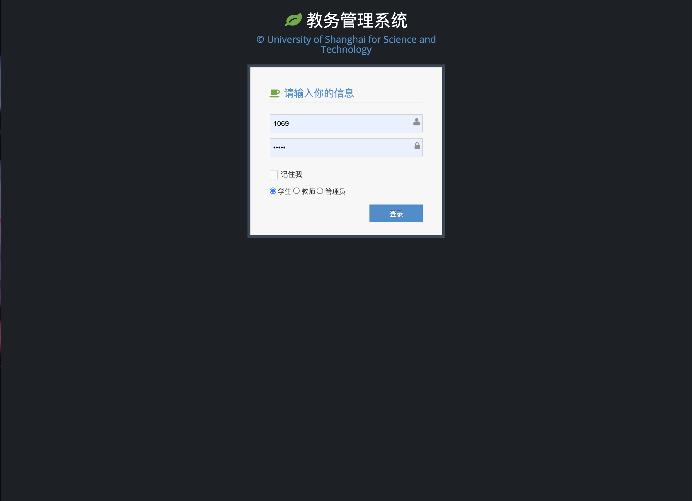
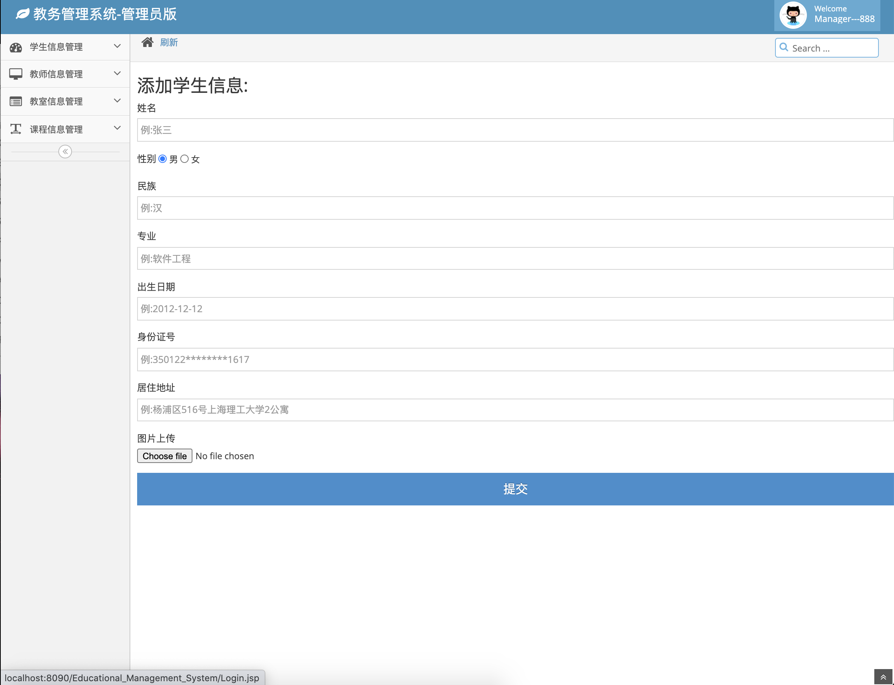
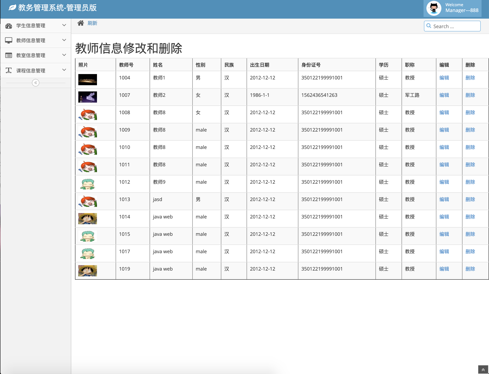
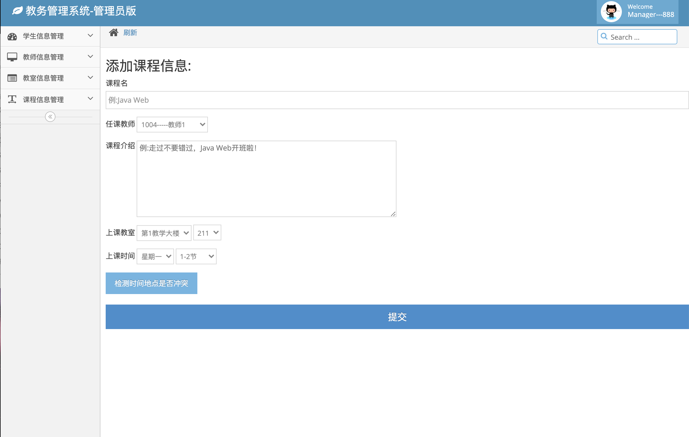
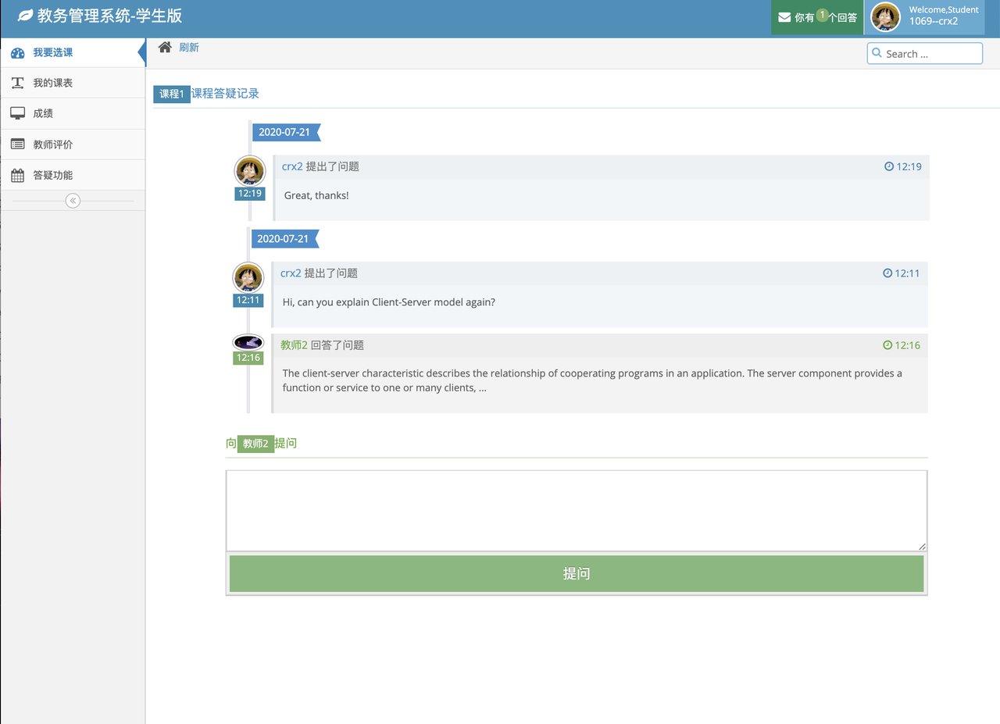

# University Educational System

## Tech Stack

1. CSS/HTML/JS
2. Bootstrap, ace tempalte
3. JSP, DOM, AJAX, jQuery
4. SQL
5. Java
   - servlet
   - DAO
   - javabean

------

**Target Users:**

1. System Administrator
2. Teacher
3. Student

**Functionalites:**

1. **System Administrator**

- Student Information Management

- Teacher Information Management

- Course Management

- Classroom Management

2. **Teacher**

- Grading

- Viewing comments from students

- Q&A

3. **Student**

- Unit registering

- Timetable

- Grades 

- Unit survey

- Q&A

