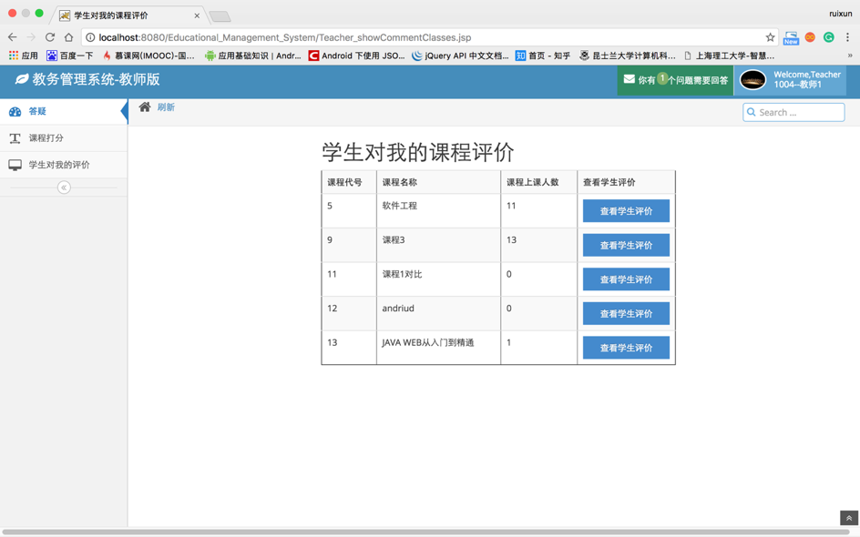

# Project1: Educational Management System

## Statement

I did this project when I was doing my bachelor in China. I used a template called "ace" to design my web pages to make the website look nice and clear, making a few minor changes. I did the back-end(Java) and database design(SQL) myself.

## Techniques I used

1. CSS/HTML/JS
2. JQuery
3. SQL
4. Java
   - servlet
   - DAO
   - javabean
   - listener
   - filter

## Functions implemented

- Welcome Page! (Login function)

.png)

- For administrator

  1. CRUD student information
     

     

  2. CRUD unit information
     

  3. CRUD teacher information

  4. CRUD classroom information

     

- For students
  1. Enrolling units
     
  2. Timetable
     
  3. Grade
     
  4. Giving comments on teachers
     
  5. Asking teacher questions
     

- For teachers

  1. Mark
     

  2. View feedback from students
     

  3. Answer questions from students
     

     

---

